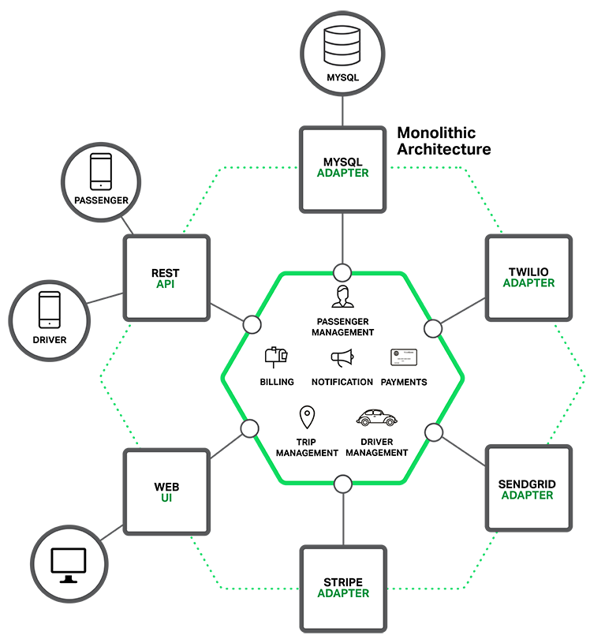
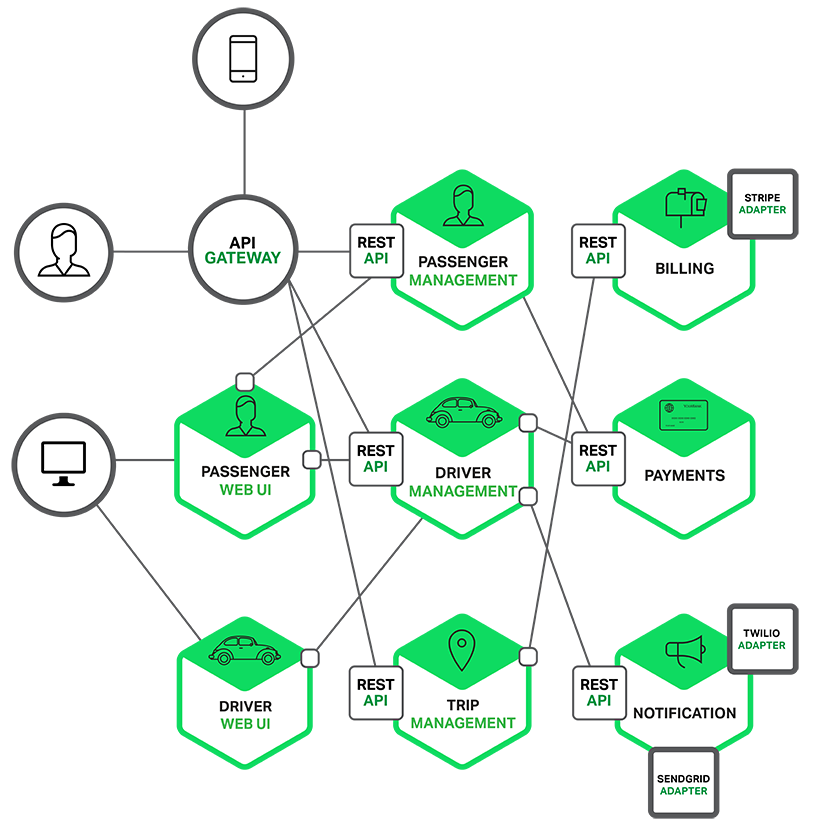
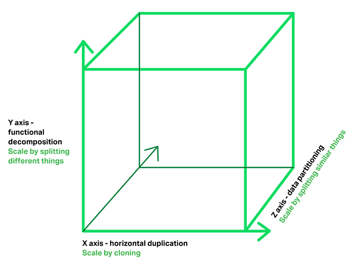
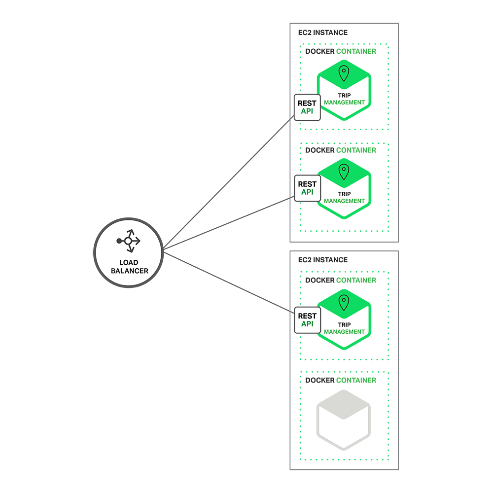
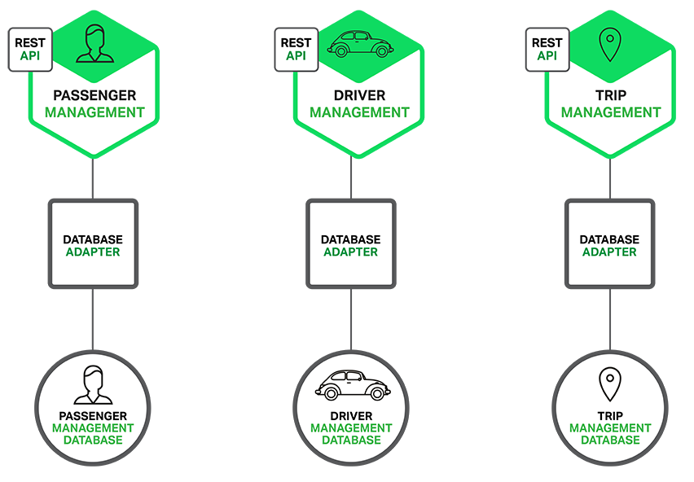
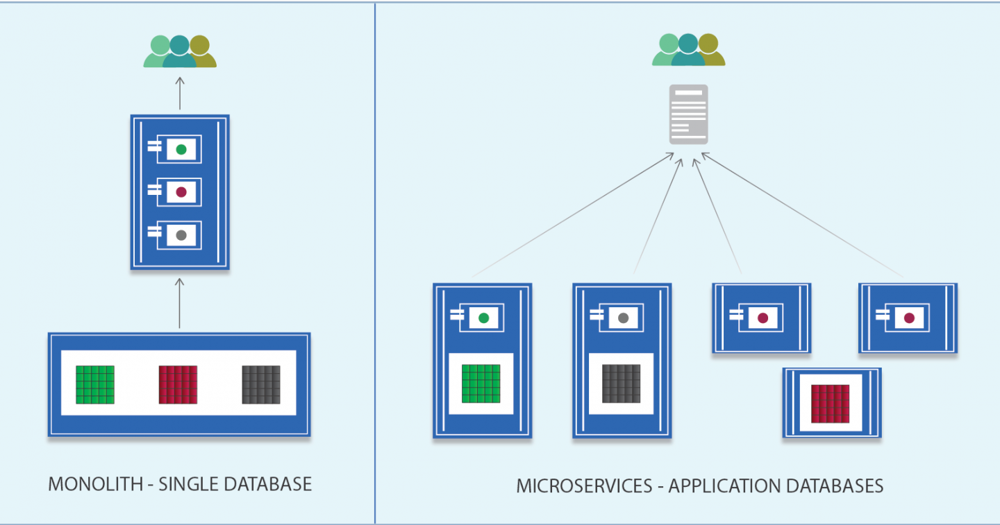
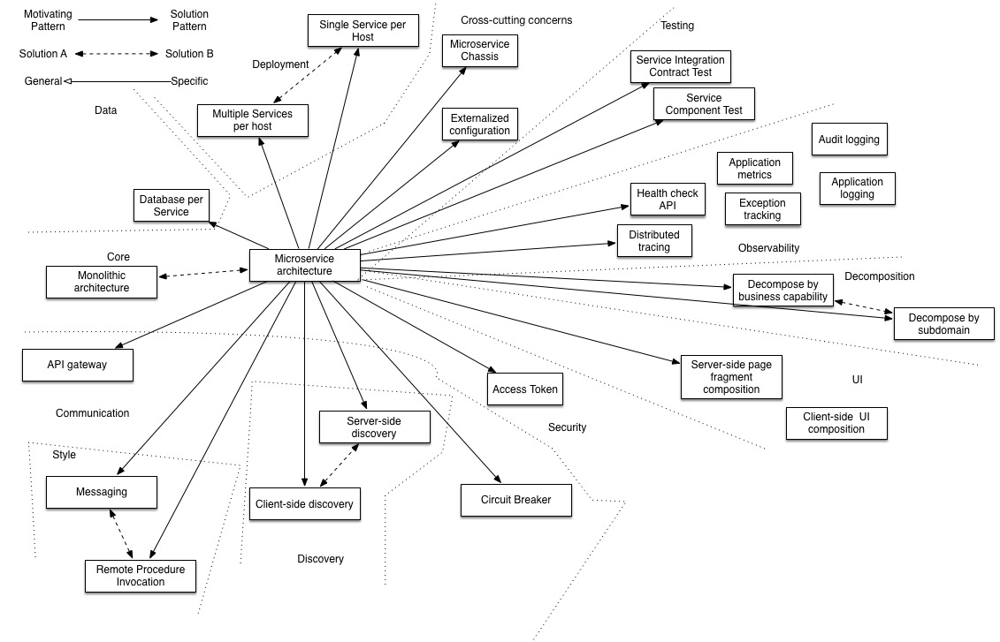

# Table of Content

- [Introduction to microservices](#introduction-to-microservices)
- [Pattern: Microservice Architecture](#pattern-microservice-architecture)
- [Related reading](#related-reading)
- [Questions](#questions)

# Introduction to microservices

Microservices are currently getting a lot of attention: articles, blogs, discussions on social media, and conference presentations. They are rapidly heading towards the peak of inflated expectations on the [Gartner Hype cycle](https://www.gartner.com/en/research/methodologies/gartner-hype-cycle). At the same time, there are skeptics in the software community who dismiss microservices as nothing new. Naysayers claim that the idea is just a rebranding of SOA. However, despite both the hype and the skepticism, the [Microservices Architecture pattern](https://microservices.io/patterns/microservices.html) has significant [benefits](https://www.nginx.com/learn/microservices-architecture/#5-Benefits-of-Microservices-Architecture) – especially when it comes to enabling the agile development and delivery of complex enterprise applications.

This blog post is the first in a seven‑part series about designing, building, and [deploying microservices](https://www.nginx.com/blog/deploying-microservices/). You will learn about the approach and how it compares to the more traditional [Monolithic Architecture pattern](https://microservices.io/patterns/monolithic.html). This series will describe the various elements of a microservices architecture. You will learn about the benefits and drawbacks of the Microservices Architecture pattern, whether it makes sense for your project, and how to apply it.

Let’s first look at why you should consider using microservices.

## Building Monolithic Applications

Let’s imagine that you were starting to build a brand new taxi‑hailing application intended to compete with Uber and Hailo. After some preliminary meetings and requirements gathering, you would create a new project either manually or by using a generator that comes with Rails, Spring Boot, Play, or Maven. This new application would have a modular [hexagonal architecture](https://www.infoq.com/news/2014/10/exploring-hexagonal-architecture/), like in the following diagram:

At the core of the application is the business logic, which is implemented by modules that define services, domain objects, and events. Surrounding the core are adapters that interface with the external world. Examples of adapters include database access components, messaging components that produce and consume messages, and web components that either expose APIs or implement a UI.

Despite having a logically modular architecture, the application is packaged and deployed as a monolith. The actual format depends on the application’s language and framework. For example, many Java applications are packaged as WAR files and deployed on application servers such as Tomcat or Jetty. Other Java applications are packaged as self‑contained executable JARs. Similarly, Rails and Node.js applications are packaged as a directory hierarchy.

Applications written in this style are extremely common. They are simple to develop since our IDEs and other tools are focused on building a single application. These kinds of applications are also simple to test. You can implement end‑to‑end testing by simply launching the application and testing the UI with Selenium. Monolithic applications are also simple to deploy. You just have to copy the packaged application to a server. You can also scale the application by running multiple copies behind a load balancer. In the early stages of the project it works well.

## Marching Towards Monolithic Hell

Unfortunately, this simple approach has a huge limitation. Successful applications have a habit of growing over time and eventually becoming huge. During each sprint, your development team implements a few more stories, which, of course, means adding many lines of code. After a few years, your small, simple application will have grown into a [monstrous monolith](https://microservices.io/patterns/monolithic.html). To give an extreme example, I recently spoke to a developer who was writing a tool to analyze the dependencies between the thousands of JARs in their multi‑million line of code (LOC) application. I’m sure it took the concerted effort of a large number of developers over many years to create such a beast.

Once your application has become a large, complex monolith, your development organization is probably in a world of pain. Any attempts at agile development and delivery will flounder. One major problem is that the application is overwhelmingly complex. It’s simply too large for any single developer to fully understand. As a result, fixing bugs and implementing new features correctly becomes difficult and time-consuming. What’s more, this tends to be a downwards spiral. If the codebase is difficult to understand, then changes won’t be made correctly. You will end up with a monstrous, incomprehensible big ball of mud.

The sheer size of the application will also slow down development. The larger the application, the longer the start‑up time is. For example, in a recent survey some developers reported start‑up times as long as 12 minutes. I’ve also heard anecdotes of applications taking as long as 40 minutes to start up. If developers regularly have to restart the application server, then a large part of their day will be spent waiting around and their productivity will suffer.

Another problem with a large, complex monolithic application is that it is an obstacle to continuous deployment. Today, the state of the art for SaaS applications is to push changes into production many times a day. This is extremely difficult to do with a complex monolith since you must redeploy the entire application in order to update any one part of it. The lengthy start‑up times that I mentioned earlier won’t help either. Also, since the impact of a change is usually not very well understood, it is likely that you have to do extensive manual testing. Consequently, continuous deployment is next to impossible to do.

Monolithic applications can also be difficult to scale when different modules have conflicting resource requirements. For example, one module might implement CPU‑intensive image processing logic and would ideally be deployed in Amazon [EC2 Compute Optimized instances](https://aws.amazon.com/ru/about-aws/whats-new/2013/11/14/announcing-new-amazon-ec2-compute-optimized-instances/). Another module might be an in‑memory database and best suited for [EC2 Memory‑optimized instances](https://aws.amazon.com/ru/about-aws/whats-new/2014/04/10/r3-announcing-the-next-generation-of-amazon-ec2-memory-optimized-instances/). However, because these modules are deployed together you have to compromise on the choice of hardware.

Another problem with monolithic applications is reliability. Because all modules are running within the same process, a bug in any module, such as a memory leak, can potentially bring down the entire process. Moreover, since all instances of the application are identical, that bug will impact the availability of the entire application.

Last but not least, monolithic applications make it extremely difficult to adopt new frameworks and languages. For example, let’s imagine that you have 2 million lines of code written using the XYZ framework. It would be extremely expensive (in both time and cost) to rewrite the entire application to use the newer ABC framework, even if that framework was considerably better. As a result, there is a huge barrier to adopting new technologies. You are stuck with whatever technology choices you made at the start of the project.

To summarize: you have a successful business‑critical application that has grown into a monstrous monolith that very few, if any, developers understand. It is written using obsolete, unproductive technology that makes hiring talented developers difficult. The application is difficult to scale and is unreliable. As a result, agile development and delivery of applications is impossible.

So what can you do about it?

## Tackling the Complexity

Many organizations, such as Amazon, eBay, and [Netflix](https://www.nginx.com/blog/microservices-at-netflix-architectural-best-practices/), have solved this problem by adopting what is now known as the [Microservices Architecture pattern](https://microservices.io/patterns/microservices.html). Instead of building a single monstrous, monolithic application, the idea is to split your application into set of smaller, interconnected services.

A service typically implements a set of distinct features or functionality, such as order management, customer management, etc. Each microservice is a mini‑application that has its own hexagonal architecture consisting of business logic along with various adapters. Some microservices would expose an API that’s consumed by other microservices or by the application’s clients. Other microservices might implement a web UI. At runtime, each instance is often a cloud VM or a Docker container.

For example, a possible decomposition of the system described earlier is shown in the following diagram:

Each functional area of the application is now implemented by its own microservice. Moreover, the web application is split into a set of simpler web applications (such as one for passengers and one for drivers in our taxi‑hailing example). This makes it easier to deploy distinct experiences for specific users, devices, or specialized use cases.

Each backend service exposes a REST API and most services consume APIs provided by other services. For example, Driver Management uses the Notification server to tell an available driver about a potential trip. The UI services invoke the other services in order to render web pages. Services might also use asynchronous, message‑based communication. Inter‑service communication will be covered in more detail later in this series.

Some REST APIs are also exposed to the mobile apps used by the drivers and passengers. The apps don’t, however, have direct access to the backend services. Instead, communication is mediated by an intermediary known as an [API Gateway](https://microservices.io/patterns/apigateway.html). The API Gateway is responsible for tasks such as load balancing, caching, access control, API metering, and monitoring, and [can be implemented effectively using NGINX](https://www.nginx.com/solutions/api-management-gateway/). Later articles in the series will cover the [API gateway](https://www.nginx.com/blog/building-microservices-using-an-api-gateway/).

The Microservices Architecture pattern corresponds to the Y‑axis scaling of the [Scale Cube](https://microservices.io/articles/scalecube.html), which is a 3D model of scalability from the excellent book [The Art of Scalability](http://theartofscalability.com/). The other two scaling axes are X‑axis scaling, which consists of running multiple identical copies of the application behind a load balancer, and Z‑axis scaling (or data partitioning), where an attribute of the request (for example, the primary key of a row or identity of a customer) is used to route the request to a particular server.

Applications typically use the three types of scaling together. Y‑axis scaling decomposes the application into microservices as shown above in the first figure in this section. At runtime, X‑axis scaling runs multiple instances of each service behind a load balancer for throughput and availability. Some applications might also use Z‑axis scaling to partition the services. The following diagram shows how the Trip Management service might be deployed with Docker running on Amazon EC2.

At runtime, the Trip Management service consists of multiple service instances. Each service instance is a Docker container. In order to be highly available, the containers are running on multiple Cloud VMs. In front of the service instances is a [load balancer such as NGINX](https://www.nginx.com/solutions/adc/) that distributes requests across the instances. The load balancer might also handle other concerns such as [caching](https://docs.nginx.com/nginx/admin-guide/content-cache/content-caching/?_ga=2.255896652.698031497.1652447399-1697960980.1652447399), [access control](https://docs.nginx.com/nginx/admin-guide/security-controls/controlling-access-proxied-http/?_ga=2.255896652.698031497.1652447399-1697960980.1652447399), [API metering](https://www.nginx.com/solutions/api-management-gateway/), and [monitoring](https://www.nginx.com/products/nginx/live-activity-monitoring/).

The Microservices Architecture pattern significantly impacts the relationship between the application and the database. Rather than sharing a single database schema with other services, each service has its own database schema. On the one hand, this approach is at odds with the idea of an enterprise‑wide data model. Also, it often results in duplication of some data. However, having a database schema per service is essential if you want to benefit from microservices, because it ensures loose coupling. The following diagram shows the database architecture for the example application.

Each of the services has its own database. Moreover, a service can use a type of database that is best suited to its needs, the so‑called polyglot persistence architecture. For example, Driver Management, which finds drivers close to a potential passenger, must use a database that supports efficient geo‑queries.

On the surface, the Microservices Architecture pattern is similar to SOA. With both approaches, the architecture consists of a set of services. However, one way to think about the Microservices Architecture pattern is that it’s SOA without the commercialization and perceived baggage of [web service specifications](https://en.wikipedia.org/wiki/List_of_web_service_specifications) (WS‑*) and an Enterprise Service Bus (ESB). Microservice‑based applications favor simpler, lightweight protocols such as REST, rather than WS‑*. They also very much avoid using ESBs and instead implement ESB‑like functionality in the microservices themselves. The Microservices Architecture pattern also rejects other parts of SOA, such as the concept of a canonical schema.

## The Benefits of Microservices

The Microservices Architecture pattern has a number of important benefits. First, it tackles the problem of complexity. It decomposes what would otherwise be a monstrous monolithic application into a set of services. While the total amount of functionality is unchanged, the application has been broken up into manageable chunks or services. Each service has a well‑defined boundary in the form of an RPC‑ or message‑driven API. The Microservices Architecture pattern enforces a level of modularity that in practice is extremely difficult to achieve with a monolithic code base. Consequently, individual services are much faster to develop, and much easier to understand and maintain.

Second, this architecture enables each service to be developed independently by a team that is focused on that service. The developers are free to choose whatever technologies make sense, provided that the service honors the API contract. Of course, most organizations would want to avoid complete anarchy and limit technology options. However, this freedom means that developers are no longer obligated to use the possibly obsolete technologies that existed at the start of a new project. When writing a new service, they have the option of using current technology. Moreover, since services are relatively small it becomes feasible to rewrite an old service using current technology.

Third, the Microservices Architecture pattern enables each microservice to be deployed independently. Developers never need to coordinate the deployment of changes that are local to their service. These kinds of changes can be deployed as soon as they have been tested. The UI team can, for example, perform A/B testing and rapidly iterate on UI changes. The Microservices Architecture pattern makes continuous deployment possible.

Finally, the Microservices Architecture pattern enables each service to be scaled independently. You can deploy just the number of instances of each service that satisfy its capacity and availability constraints. Moreover, you can use the hardware that best matches a service’s resource requirements. For example, you can deploy a CPU‑intensive image processing service on EC2 Compute Optimized instances and deploy an in‑memory database service on EC2 Memory‑optimized instances.

## The Drawbacks of Microservices

As Fred Brooks wrote almost 30 years ago, there are no silver bullets. Like every other technology, the Microservices architecture has drawbacks. One drawback is the name itself. The term microservice places excessive emphasis on service size. In fact, there are some developers who advocate for building extremely fine‑grained 10–100 LOC services. While small services are preferable, it’s important to remember that they are a means to an end and not the primary goal. The goal of microservices is to sufficiently decompose the application in order to facilitate agile application development and deployment.

Another major drawback of microservices is the complexity that arises from the fact that a microservices application is a distributed system. Developers need to choose and implement an inter‑process communication mechanism based on either messaging or RPC. Moreover, they must also write code to handle partial failure since the destination of a request might be slow or unavailable. While none of this is rocket science, it’s much more complex than in a monolithic application where modules invoke one another via language‑level method/procedure calls.

Another challenge with microservices is the partitioned database architecture. Business transactions that update multiple business entities are fairly common. These kinds of transactions are trivial to implement in a monolithic application because there is a single database. In a microservices‑based application, however, you need to update multiple databases owned by different services. Using distributed transactions is usually not an option, and not only because of the CAP theorem. They simply are not supported by many of today’s highly scalable NoSQL databases and messaging brokers. You end up having to use an eventual consistency based approach, which is more challenging for developers.

Testing a microservices application is also much more complex. For example, with a modern framework such as Spring Boot it is trivial to write a test class that starts up a monolithic web application and tests its REST API. In contrast, a similar test class for a service would need to launch that service and any services that it depends upon (or at least configure stubs for those services). Once again, this is not rocket science, but it’s important to not underestimate the complexity of doing this.

Another major challenge with the Microservices Architecture pattern is implementing changes that span multiple services. For example, let’s imagine that you are implementing a story that requires changes to services A, B, and C, where A depends upon B and B depends upon C. In a monolithic application you could simply change the corresponding modules, integrate the changes, and deploy them in one go. In contrast, in a Microservices Architecture pattern you need to carefully plan and coordinate the rollout of changes to each of the services. For example, you would need to update service C, followed by service B, and then finally service A. Fortunately, most changes typically impact only one service and multi‑service changes that require coordination are relatively rare.

Deploying a microservices‑based application is also much more complex. A monolithic application is simply deployed on a set of identical servers behind a traditional load balancer. Each application instance is configured with the locations (host and ports) of infrastructure services such as the database and a message broker. In contrast, a microservice application typically consists of a large number of services. For example, Hailo has 160 different services and Netflix has over 600 according to [Adrian Cockcroft](https://twitter.com/adrianco) _[Editor – Hailo has been acquired by MyTaxi.]_. Each service will have multiple runtime instances. That’s many more moving parts that need to be configured, deployed, scaled, and monitored. In addition, you will also need to implement a service discovery mechanism (discussed in a later post) that enables a service to discover the locations (hosts and ports) of any other services it needs to communicate with. Traditional trouble ticket‑based and manual approaches to operations cannot scale to this level of complexity. Consequently, successfully deploying a microservices application requires greater control of deployment methods by developers, and a high level of automation.

One approach to automation is to use an off‑the‑shelf PaaS such as [Cloud Foundry](https://www.cloudfoundry.org/). A PaaS provides developers with an easy way to deploy and manage their microservices. It insulates them from concerns such as procuring and configuring IT resources. At the same time, the systems and network professionals who configure the PaaS can ensure compliance with best practices and with company policies. Another way to automate the deployment of microservices is to develop what is essentially your own PaaS. One typical starting point is to use a clustering solution, such as [Kubernetes](https://kubernetes.io/), in conjunction with a technology such as Docker. Later in this series we will look at how [software‑based application delivery](https://www.nginx.com/products/nginx/) approaches like NGINX Plus, which easily handles caching, access control, API metering, and monitoring at the microservice level, can help solve this problem.

## Summary

Building complex applications is inherently difficult. A Monolithic architecture only makes sense for simple, lightweight applications. You will end up in a world of pain if you use it for complex applications. The Microservices architecture pattern is the better choice for complex, evolving applications despite the drawbacks and implementation challenges.

In later blog posts, I’ll dive into the details of various aspects of the Microservices Architecture pattern and discuss topics such as service discovery, service deployment options, and strategies for refactoring a monolithic application into services.

Stay tuned...

# Pattern: Microservice Architecture

## Context

You are developing a server-side enterprise application. It must support a variety of different clients including desktop browsers, mobile browsers and native mobile applications. The application might also expose an API for 3rd parties to consume. It might also integrate with other applications via either web services or a message broker. The application handles requests (HTTP requests and messages) by executing business logic; accessing a database; exchanging messages with other systems; and returning HTML/JSON/XML response. There are logical components corresponding to different functional areas of the application.

## Problem

What’s the application’s deployment architecture?

## Forces

- There is a team of developers working on the application
- New team members must quickly become productive
- The application must be easy to understand and modify
- You want to practice continuous deployment of the application
- You must run multiple instances of the application on multiple machines in order to satisfy scalability and availability requirements
- You want to take advantage of emerging technologies (frameworks, programming languages, etc)

## Solution

Define an architecture that structures the application as a set of loosely coupled, collaborating services. This approach corresponds to the Y-axis of the [Scale Cube](https://microservices.io/articles/scalecube.html). Each service is:

- Highly maintainable and testable - enables rapid and frequent development and deployment
- Loosely coupled with other services - enables a team to work independently the majority of time on their service(s) without being impacted by changes to other services and without affecting other services
- Independently deployable - enables a team to deploy their service without having to coordinate with other teams
- Capable of being developed by a small team - essential for high productivity by avoiding the high communication head of large teams

Services communicate using either synchronous protocols such as HTTP/REST or asynchronous protocols such as AMQP. Services can be developed and deployed independently of one another. Each service has its [own database](https://microservices.io/patterns/data/database-per-service.html) in order to be decoupled from other services. Data consistency between services is maintained using the [Saga pattern](https://microservices.io/patterns/data/saga.html)

To learn more about the nature of a service, please [read this article](http://chrisrichardson.net/post/microservices/general/2019/02/16/whats-a-service-part-1.html).

## Example

### Fictitious e-commerce application

Let’s imagine that you are building an e-commerce application that takes orders from customers, verifies inventory and available credit, and ships them. The application consists of several components including the StoreFrontUI, which implements the user interface, along with some backend services for checking credit, maintaining inventory and shipping orders. The application consists of a set of services.

### Show me the code

Please see [the example applications developed by Chris Richardson](https://eventuate.io/exampleapps.html). These examples on GitHub illustrate various aspects of the microservice architecture.

## Resulting context

### Benefits

This solution has a number of benefits:

- Enables the continuous delivery and deployment of large, complex applications.
    - Improved maintainability - each service is relatively small and so is easier to understand and change
    - Better testability - services are smaller and faster to test
    - Better deployability - services can be deployed independently
    - It enables you to organize the development effort around multiple, autonomous teams. Each (so-called two pizza) team owns and is responsible for one or more services. Each team can develop, test, deploy and scale their services independently.
- Each microservice is relatively small:
    - Easier for a developer to understand
    - The IDE is faster making developers more productive
    - The application starts faster, which makes developers more productive, and speeds up deployments
- Improved fault isolation. For example, if there is a memory leak in one service then only that service will be affected. The other services will continue to handle requests. In comparison, one misbehaving component of a monolithic architecture can bring down the entire system.
- Eliminates any long-term commitment to a technology stack. When developing a new service you can pick a new technology stack. Similarly, when making major changes to an existing service you can rewrite it using a new technology stack.

### Drawbacks

This solution has a number of drawbacks:

- Developers must deal with the additional complexity of creating a distributed system:
    - Developers must implement the inter-service communication mechanism and deal with partial failure
    - Implementing requests that span multiple services is more difficult
    - Testing the interactions between services is more difficult
    - Implementing requests that span multiple services requires careful coordination between the teams
    - Developer tools/IDEs are oriented on building monolithic applications and don’t provide explicit support for developing distributed applications.
- Deployment complexity. In production, there is also the operational complexity of deploying and managing a system comprised of many services.
- Increased memory consumption. The microservice architecture replaces N monolithic application instances with NxM services instances. If each service runs in its own JVM (or equivalent), which is usually necessary to isolate the instances, then there is the overhead of M times as many JVM runtimes. Moreover, if each service runs on its own VM (e.g. EC2 instance), as is the case at Netflix, the overhead is even higher.

## Issues

There are many issues that you must address.

### When to use the microservice architecture?

One challenge with using this approach is deciding when it makes sense to use it. When developing the first version of an application, you often do not have the problems that this approach solves. Moreover, using an elaborate, distributed architecture will slow down development. This can be a major problem for startups whose biggest challenge is often how to rapidly evolve the business model and accompanying application. Using Y-axis splits might make it much more difficult to iterate rapidly. Later on, however, when the challenge is how to scale, and you need to use functional decomposition, the tangled dependencies might make it difficult to decompose your monolithic application into a set of services.

### How to decompose the application into services?

Another challenge is deciding how to partition the system into microservices. This is very much an art, but there are a number of strategies that can help:

- [Decompose by business capability](https://microservices.io/patterns/decomposition/decompose-by-business-capability.html) and define services corresponding to business capabilities.
- [Decompose by domain-driven design subdomain](https://microservices.io/patterns/decomposition/decompose-by-subdomain.html).
- Decompose by verb or use case and define services that are responsible for particular actions. e.g. a `Shipping Service` that’s responsible for shipping complete orders.
- Decompose by nouns or resources by defining a service that is responsible for all operations on entities/resources of a given type. e.g. an `Account Service` that is responsible for managing user accounts.

Ideally, each service should have only a small set of responsibilities. (Uncle) Bob Martin talks about designing classes using the [Single Responsibility Principle (SRP)](https://www.booked.net/objectmentor). The SRP defines a responsibility of a class as a reason to change, and states that a class should only have one reason to change. It makes sense to apply the SRP to service design as well.

Another analogy that helps with service design is the design of Unix utilities. Unix provides a large number of utilities such as grep, cat and find. Each utility does exactly one thing, often exceptionally well, and is intended to be combined with other utilities using a shell script to perform complex tasks.

### How to maintain data consistency?

In order to ensure loose coupling, each service has its own database. Maintaining data consistency between services is a challenge because 2 phase-commit/distributed transactions is not an option for many applications. An application must instead use the [Saga pattern](https://microservices.io/patterns/data/saga.html). A service publishes an event when its data changes. Other services consume that event and update their data. There are several ways of reliably updating data and publishing events including [Event Sourcing](https://microservices.io/patterns/data/event-sourcing.html) and [Transaction Log Tailing](https://microservices.io/patterns/data/transaction-log-tailing.html).

### How to implement queries?

Another challenge is implementing queries that need to retrieve data owned by multiple services.

- The [API Composition](https://microservices.io/patterns/data/api-composition.html) and [Command Query Responsibility Segregation (CQRS)](https://microservices.io/patterns/data/cqrs.html) patterns.

## Related patterns

There are many patterns related to the microservices pattern. The [Monolithic architecture](https://microservices.io/patterns/monolithic.html) is an alternative to the microservice architecture. The other patterns address issues that you will encounter when applying the microservice architecture.

- Decomposition patterns
    - [Decompose by business capability](https://microservices.io/patterns/decomposition/decompose-by-business-capability.html)
    - [Decompose by subdomain](https://microservices.io/patterns/decomposition/decompose-by-subdomain.html)
- The [Database per Service pattern](https://microservices.io/patterns/data/database-per-service.html) describes how each service has its own database in order to ensure loose coupling.
- The [API Gateway pattern](https://microservices.io/patterns/apigateway.html) defines how clients access the services in a microservice architecture.
- The [Client-side Discovery](https://microservices.io/patterns/client-side-discovery.html) and [Server-side Discovery](https://microservices.io/patterns/server-side-discovery.html) patterns are used to route requests for a client to an available service instance in a microservice architecture.
- The Messaging and Remote Procedure Invocation patterns are two different ways that services can communicate.
- The [Single Service per Host](https://microservices.io/patterns/deployment/single-service-per-host.html) and [Multiple Services per Host](https://microservices.io/patterns/deployment/multiple-services-per-host.html) patterns are two different deployment strategies.
- Cross-cutting concerns patterns: [Microservice chassis pattern](https://microservices.io/patterns/microservice-chassis.html) and [Externalized configuration](https://microservices.io/patterns/externalized-configuration.html)
- Testing patterns: [Service Component Test](https://microservices.io/patterns/testing/service-component-test.html) and [Service Integration Contract Test](https://microservices.io/patterns/testing/service-integration-contract-test.html)
- [Circuit Breaker](https://microservices.io/patterns/reliability/circuit-breaker.html)
- [Access Token](https://microservices.io/patterns/security/access-token.html)
- Observability patterns:
    - [Log aggregation](https://microservices.io/patterns/observability/application-logging.html)
    - [Application metrics](https://microservices.io/patterns/observability/application-metrics.html)
    - [Audit logging](https://microservices.io/patterns/observability/audit-logging.html)
    - [Distributed tracing](https://microservices.io/patterns/observability/distributed-tracing.html)
    - [Exception tracking](https://microservices.io/patterns/observability/exception-tracking.html)
    - [Health check API](https://microservices.io/patterns/observability/health-check-api.html)
    - [Log deployments and changes](https://microservices.io/patterns/observability/log-deployments-and-changes.html)
- UI patterns:
    - [Server-side page fragment composition](https://microservices.io/patterns/ui/server-side-page-fragment-composition.html)
    - [Client-side UI composition](https://microservices.io/patterns/ui/client-side-ui-composition.html)

## Known uses

Most large scale websites including Netflix, [Amazon](http://highscalability.com/blog/2007/9/18/amazon-architecture.html) and [eBay](http://www.addsimplicity.com/downloads/eBaySDForum2006-11-29.pdf) have evolved from a monolithic architecture to a microservice architecture.

Netflix, which is a very popular video streaming service that’s responsible for up to 30% of Internet traffic, has a large scale, service-oriented architecture. They handle over a billion calls per day to their video streaming API from over 800 different kinds of devices. Each API call fans out to an average of six calls to backend services.

[Amazon.com](https://www.amazon.com/) originally had a two-tier architecture. In order to scale they migrated to a service-oriented architecture consisting of hundreds of backend services. Several applications call these services including the applications that implement the [Amazon.com](https://www.amazon.com/) website and the web service API. The [Amazon.com](https://www.amazon.com/) website application calls 100-150 services to get the data that used to build a web page.

The auction site [ebay.com](https://www.ebay.com/) also evolved from a monolithic architecture to a service-oriented architecture. The application tier consists of multiple independent applications. Each application implements the business logic for a specific function area such as buying or selling. Each application uses X-axis splits and some applications such as search use Z-axis splits. [Ebay.com](https://www.ebay.com/) also applies a combination of X-, Y- and Z-style scaling to the database tier.

There are [numerous other examples](https://microservices.io/articles/whoisusingmicroservices.html) of companies using the microservice architecture.

## Examples

Chris Richardson has [examples](https://eventuate.io/exampleapps.html) of microservices-based applications.

## See also

See my [Code Freeze 2018 keynote](https://microservices.io/microservices/news/2018/02/20/no-such-thing-as-a-microservice.html), which provides a good introduction to the microservice architecture.

# Related reading

- [Introduction to Microservices](https://www.nginx.com/blog/introduction-to-microservices/)
- [Pattern: Monolithic Architecture](https://microservices.io/patterns/monolithic.html)
- [Pattern: Microservice Architecture](https://microservices.io/patterns/microservices.html)
- [Monolithic vs. Microservices Architecture: How the Software Structure Can Influence the Efficiency](https://magora-systems.com/monolithic-architecture-vs-microservices/)
- [10 Microservice Best Practices](https://www.simform.com/blog/microservice-best-practices/)
- [What Is SOA? Service-Oriented Architecture Explained](https://www.bmc.com/blogs/service-oriented-architecture-overview/)
- [What is REST](https://restfulapi.net/)
- [SOAP vs. REST: A Look at Two Different API Styles](https://www.upwork.com/resources/soap-vs-rest-a-look-at-two-different-api-styles)
- [REST vs. RESTFUL: What’s the Difference?](https://blog.ndepend.com/rest-vs-restful/)
- [What is the Difference Between RESTFUL and RESTLESS Web Service](https://pediaa.com/what-is-the-difference-between-restful-and-restless-web-service/)
- [Microservices Foundations](https://www.linkedin.com/learning/microservices-foundations/welcome?autoplay=true&u=2113185) [Video course]
- [Creating Your First Spring Boot Microservice](https://www.linkedin.com/learning/creating-your-first-spring-boot-microservice/build-a-microservice-with-spring-boot?autoplay=true&u=2113185) [Video course]

# Questions

- What is a microservice?
- What is the difference between architecture styles -monolith, SOA, microservices?
- Could you provide practical samples in which cases which architecture style you will select?
- What are the advantages of microservices?
- What are the disadvantages of microservices?
- What is cross-cutting concerns? Describe types you know?
